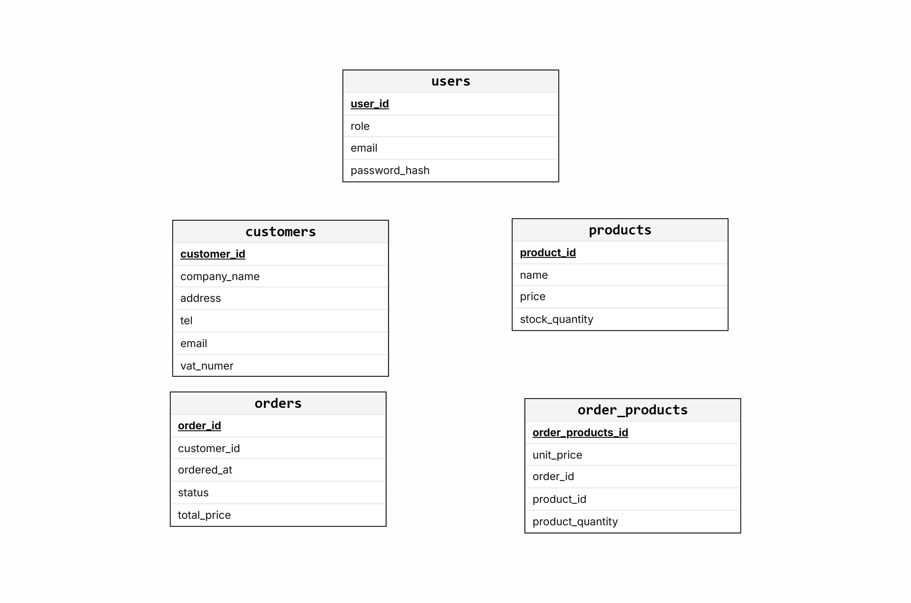

# Keskusvarasto API - Projektisuunnitelma (v1)

Tämä dokumentti sisältää keskusvarastoprojektin teknisen kuvauksen, tietokantamallin ja rajapintamääritykset. Järjestelmä on suunniteltu palvelemaan keskusvarastoa, josta asiakaskaupat tilaavat tuotteita.

---

## 1. Tietokantamalli (ER-kaavio)

Tietokanta koostuu viidestä taulusta, jotka mahdollistavat käyttäjien, asiakaskauppojen, tuotteiden ja tilausten hallinnan.



### Taulujen kuvaukset:

- **users**: Järjestelmän käyttäjät ja roolit.
- **customers**: Asiakaskaupat (nimi, osoite, VAT-numero).
- **products**: Varaston tuotevalikoima ja reaaliaikainen saldo.
- **orders**: Kauppojen tekemät tilaukset ja niiden tila (status).
- **order_products**: Liitostaulu, joka yhdistää tilaukset ja tuotteet (sisältää tilaushetken hinnan ja määrän).

---

## 2. API-määritykset: Tuotteet (`/api/v1/products`)

Tuotemoduuli vastaa varastotilanteen seurannasta ja tuotetietojen ylläpidosta.

| Metodi     | Polku                  | Status (OK)      | Virhe (4xx) | Kuvaus                                                         |
| :--------- | :--------------------- | :--------------- | :---------- | :------------------------------------------------------------- |
| **GET**    | `/api/v1/products`     | `200 OK`         | -           | Palauttaa kaikki tuotteet. Tyhjä lista `[]`, jos ei tuotteita. |
| **GET**    | `/api/v1/products/:id` | `200 OK`         | `404`       | Hakee yhden tuotteen tiedot ID:n perusteella.                  |
| **POST**   | `/api/v1/products`     | `201 Created`    | `400`       | Lisää uuden tuotteen. Palauttaa luodun objektin.               |
| **PATCH**  | `/api/v1/products/:id` | `200 OK`         | `400 / 404` | Päivittää tuotteen (esim. hinta tai saldo).                    |
| **DELETE** | `/api/v1/products/:id` | `204 No Content` | `404`       | Poistaa tuotteen pysyvästi järjestelmästä.                     |

---

## 3. Data-esimerkit (JSON)

### 3.1 Uuden tuotteen luominen (POST)

**Endpoint:** `POST /api/v1/products`  
**Request Body:**

```json
{
  "name": "Mutteripannu 6 kuppia",
  "price": 2490,
  "stock_quantity": 50
}
```

### Vastaus (201 created):

```json
{
  "product_id": 101,
  "name": "Mutteripannu 6 kuppia",
  "price": 2490,
  "stock_quantity": 50
}
```

### 3.2 Tuotteen tietojen päivitys (PATCH)

**Endpoint:** `PATCH /api/v1/products/101`
**Request Body:**

```json
{
  "stock_quantity": 65
}
```

### 3.3 Uuden tilauksen tekeminen (POST)

**Endpoint:** POST /api/v1/orders
**Request Body**

```json
{
  "customer_id": 5,
  "items": [
    {
      "product_id": 101,
      "quantity": 10
    },
    {
      "product_id": 102,
      "quantity": 5
    }
  ]
}
```

### 400 Bad Request: Lähetetty JSON on viallinen tai pakollisia kenttiä puuttuu.

### 404 Not Found: Resurssia (tuote/tilaus) ei löydy annetulla ID:llä.

### Hinnat: Tallennetaan kokonaislukuina (sentteinä) tarkkuuden varmistamiseksi.
